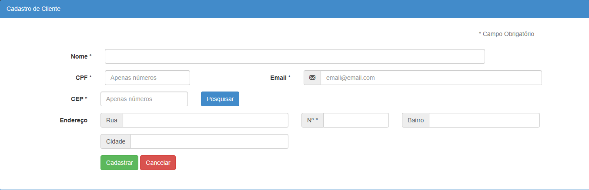

# Teste Integrado com API Via CEP 🚀

Este programa de teste foi desenvolvido para validar algumas funcionalidades importantes, utilizando a API Via CEP para consultar dados de CEP diretamente dos Correios.

## ➡️ Funcionalidades do Código

1. **Validação de CPF:** Verifica se um CPF é válido.
2. **Validação de E-mail:** Realiza a validação de endereços de e-mail.
3. **Validação de CEP:** Garante a validade do formato do CEP.
4. **Consulta de CEP com a API do Correio (Via CEP):** Fornece informações detalhadas ao consultar a API do Correio para um CEP específico.

## ➡️ Instalação 

1. Instale o programa dentro da pasta `/var/www/html` ou analise o diretório onde o PHP está instalado para renderizar.
2. Execute o comando `composer dump-autoload` para baixar as bibliotecas necessárias.
3. Acesse o diretório do programa via web e execute.

## ➡️ Telas da Aplicação

